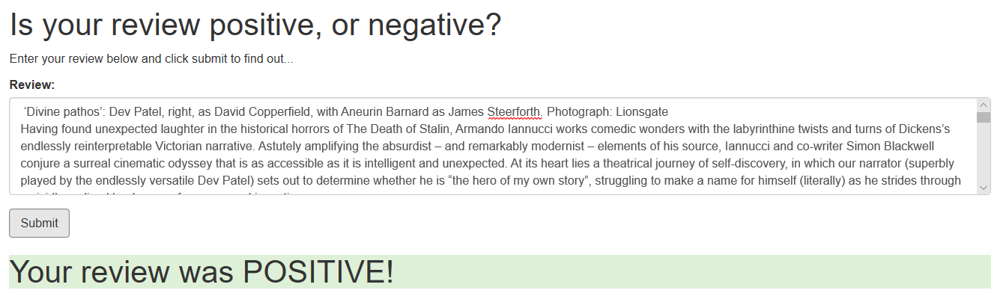

# Deploy a Sentiment Analysis Model

## Udacity Machine Learning Engineer Nanodegree - Project 1

### Project Introduction
This project is a small [Web App](https://en.wikipedia.org/wiki/Web_application), based on [Amazon SageMaker](https://aws.amazon.com/de/sagemaker/), which can be used to easily and quickly predict whether a review is `positive` or `negative`. 

#### Example
Here is a review example for the film: [The Personal History of David Copperfield](https://www.theguardian.com/film/2020/jan/26/the-personal-history-of-david-copperfield-review-armando-iannucci-dev-patel)

These review was posted on 26 January 2020 by Mark Kermode and was rated by him with 5 stars, therefore the review is to be rated `POSITIVE`.

With the [Sentiment Analysis Web App](website/index.html), the review text can be analyzed to determine whether it is positive or negative (*Assumes that the corresponding model endpoint is enabled in Amazon SageMaker!*).
The original review text can be cut and pasted into the review input field of the Web App. When you click on the Submit button, the system displays a prediction as to whether the review is to be considered `positive` or `negative`:

### Model Building and Deployment
The Jupyter Notebook [SageMaker Project](SageMaker%20Project.ipynb) explains how the model was created, tested and deployed using Amazon SageMaker.
The result is also shown in the [report.html](report.html) file.
